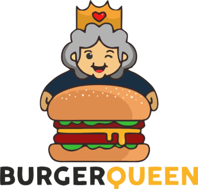
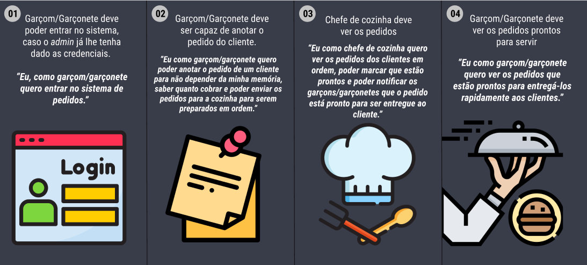

<div align="center">




#### Projeto desenvolvido no Bootcamp Laboratoria SAP007

</div>

## Índice

* [Sobre o projeto](#sobre-o-projeto)
* [Como utilizar](#como-utilizar)
* [Testes de usabilidade](#testes-de-usabilidade)
* [Tecnologias utilizadas](#tecnologias-utilizadas)
* [Estrutura dos arquivos](#estrutura-dos-arquivos)
* [Autora](#autora)

---
## Sobre o projeto

O produto possibilita que um funcionário do restaurante faça pedidos e acompanhe o preparo deles ordenadamente atráves de uma interface intuitiva que foi feita pensada na agilidade e na praticidade do usuário. <br>
O projeto foi proposto pela Laboratoria e teve como algumas premissas ser um SPA (*Single Page App*) responsivo em tablets, ter estrutura definida de pastas e arquivos, manter a interface e o estado sincronizados, além do uso de Javascript e o consumo da [Burger Queen API](https://lab-api-bq.herokuapp.com/api-docs/) e do framework React. <br><br>

<div align='center'>
  
  **Você pode acessar a aplicação utilizando um dos logins de teste abaixo:**

 

 |      |          Salão          |      Cozinha            |
 |------|-------------------------|-------------------------|
 |  📨  |     salao@mail.com      |    cozinha@mail.com     |
 |  🔐  |         1234            |         1234            |

 <br>


</div>

- **Sobre o cliente**

Uma pequena hamburgueria chamada Burger Queen possui atendimento 24 horas e está crescendo. Assim, precisa de uma interface na qual possa realizar pedidos usando um tablet e enviá-los para a cozinha para que sejam preparados de forma ordenada e otimizada. O restaurante em questão possui um menu mais simples para o café da manhã e outro mais complexo para o restante do dia e ambos devem ser exibidos na aplicação. <br><br>

- **Histórias de usuário**

<div align="center">

As histórias de usuário a serem desenvolvidas foram fornecidas pelo Burger Queen, sendo elas:



</div>

<!-- ##  Protótipos 

### Paleta de Cores 

 -->


---
## Como Utilizar

- A tela inicial da aplicação traz a **página de login** que apresenta ao usário as opções de fazer o login com email e senha já cadastrados ou prosseguir para a página de cadastro;
- Na **página de cadastro**, o funcionário pode cadastrar-se inserindo seus dados de nome, e-mail, senha e setor de trabalho;
- Ao realizar qualquer uma dessas formas de acesso, o usuário será encaminhado para o seu respectivo ambiente:
    1. **Salão**: para os garçons/garçonetes, onde ocorrerá a anotação e encaminhamento dos pedidos para a cozinha;
    2. **Cozinha**: para os cozinheiros que receberão a demanda dos pedidos realizados.


<!--<h1 align="center">
  
  colocar gif da aplicação aqui
</h1> -->

---
##  Testes de Usabilidade

Após o desenvolvimento do projeto, foram realizados testes de usabilidade com diferentes indivíduos no intuito de analisar a experiência do usuário com a interface da aplicação. Com base nos resultados desses testes, deixamos como implementação futura:

- Tempo de preparação exibido somente na área de pedidos entregues;
- Responsividade para tablet em formato retrato, adaptando a exibição do carrinho na página de Salão;
- Histórico com filtragem de pedidos do dia atual;
- Atualização automática dos pedidos;

---
##  Tecnologias Utilizadas

| Ferramenta | Descrição |
| --- | --- |
| `React` | Uma biblioteca JavaScript para criar interfaces de usuário |
| `HTML 5` | Linguagem de marcação |
| `CSS` | Linguagem de estilização |
| `JavaScript` |  Linguagem de programação interpretada estruturada |
| `Node.js` | Software de execução de códigos JavaScript |
| `Git e GitHub` | Sistemas de controle de versões distribuídos |
| `Canva e Figma` | Editor gráfico de vetor e prototipagem de projetos |

---

##  Estrutura dos arquivos
```
.
├── 📁public
|
├── 📁src
|   |
|   ├── 📁assets
|   |
|   ├── 📁components
|   |   ├── 📁AppMenu
|   |   ├── 📁Button
|   |   ├── 📁Client
|   |   ├── 📁Error
|   |   ├── 📁Form
|   |   ├── 📁Input
|   |   ├── 📁InputPassword
|   |   ├── 📁Menu
|   |   ├── 📁Modal
|   |   ├── 📁Order
|   |   ├── 📁OrderList
|   |   ├── 📁PrincipalMenu
|   |   ├── 📁PrincipalMenuOrder
|   |   ├── 📁Product
|   |   ├── 📁ProductList
|   |   ├── 📁Radio
|   |   ├── 📁Select
|   |   ├── 📁PopupCancel
|   |   └── 📁ProductArea
|   |
|   ├── 📁pages
|   |   ├── 📁Hall
|   |   ├── 📁Kitchen
|   |   ├── 📁Login
|   |   └── 📁Register
|   |
|   ├── 📁services
|   |   |── 📁auth.service.js
|   |   ├── 📁orders.service.js
|   |   ├── 📁products.service.js
|   |   └── 📁user.service.js
|   |   
|   ├── 📄appSettings.js
|   ├── 📄global.style.module.css
|   ├── 📄index.js
|   └── 📄routes.js
|   └── 📄setupTests.js
|
└── 📄package-lock.json
└── 📄package.json
└── 📄README.md
```
---

## Autora

<div align= "center">
     
  </div>
  <h3 align="center"><a href="https://github.com/Maryssun">Dayanne Maryssol</a></h3>
  <div align="center">
    <a href = "mailto:maryssol.dayanne@gmail.com" target="_blank"></a>
     <a href="https://www.linkedin.com/in/dayannemaryssol/" target="_blank"></a>
  </div>
